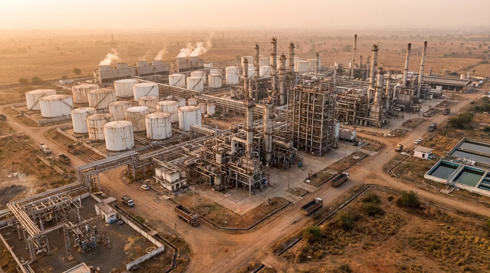

# IGPL 2026 Redesign — Build Contract (READ FIRST)

You are upgrading interior pages of the IGPL corporate site to a **bold premium** visual
language that has already been established on `index.html` (the flagship reference) and in
`css/igpl-2026.css` (the theme layer, already linked on every page).

**Tech:** static HTML + Tailwind (CDN) + `css/design-system.css` + `css/igpl-2026.css`.
Local preview: http://127.0.0.1:8123 . Brand: teal `#007C66`. Display font: **Space Grotesk**
(already loaded + auto-applied to all headings/`font-[Montserrat]`). Body: Inter.

## HARD RULES (do not break)
1. **Do NOT edit** `index.html`, `css/design-system.css`, `css/igpl-2026.css`, or `js/igpl.js`.
   Only edit the HTML pages assigned to you.
2. **Never invent facts.** Use only numbers/claims already present on the site:
   275,110  MTPA · 5 plants · ~50% India PA share · 34 years (since 1992) · NSE: IGPL ·
   BSE: 500199 · 68.74% promoter holding · ISO 9001:2015, ISO 14001:2015, HALAL, Star-K.
   Do NOT invent revenue, EBITDA, customer names, export %, country counts, or awards.
   If a recommended block needs data you don't have, insert `<!-- TODO(owner): add X -->`
   and build the structure with the safe figures above — never fabricate.
3. **Preserve all real content & links.** Restructure/restyle; don't delete substantive copy.
4. Keep each page's nav + footer **identical to index.html's** (see footer addition below).
5. Verify your edits: re-read changed regions; ensure no unclosed tags, no broken `href`s,
   valid JSON-LD. Do not leave the page in a broken state.

## THE VISUAL LANGUAGE (apply consistently)

**Tonal rhythm — the #1 move.** Stop the all-white monotony. Alternate section backgrounds:
white → `section-tint` (pale teal-grey `#EEF5F2`) → white → a dark `section-ink` band → white.
Every page should have **at least one `section-ink` dark band** and at least one `section-tint`.
Dark sections already auto-darken if they use `bg-[#1E293B]` / `bg-[#0F172A]` / `.igpl-page-hero`.

**Page hero.** Most interior pages have an `.igpl-page-hero` or dark hero — it already renders as
forest-ink + Space Grotesk. Upgrade it: add an `eyebrow-2026` label, make the H1 large
(`text-[40px] md:text-[60px]` bold, tracking-[-0.02em], leading tight), and where the page has
key numbers, render them as **stat monuments** (see below) in the hero or a band right under it.

**Stat monuments** (use for any standout numbers):
```html
<div class="stat-monument">
  <div class="stat-monument__value">275,110 <span class="unit">MTPA</span></div>
  <div class="stat-monument__rule"></div>
  <p class="stat-monument__label">PA Capacity</p>
</div>
```
On dark (`section-ink`) the value is white + mint rule automatically. Group 3–4 in a flex/grid row.

**Cards.** Replace thin-border text-only cards. Use `.elevated-card` (white, hairline, teal top
accent, soft shadow, hover-lift) — or for cards that already use `.card-lift.bg-white` the theme
already elevates them, so just ensure padding is generous (`p-8`) and icons are sized. For dark
sections use `.ink-card`. Give content cards a heading + supporting line; add an icon tile
(`.sector-icon` pattern, ~60px) where natural. No tiny icons floating in big voids.

**Full-bleed photo band** (use as a chapter break where a relevant real photo exists — e.g.
`plant-aerial.webp`, `dcs-control-room.webp`, `steam-pipes.webp`, `lab-scientist.webp`,
`plant-night.jpg`, `team-outdoor-v2.webp`). NEVER use the AI-looking ones
(`products-hero.webp`, `investors-hero.webp`, `sustainability-hero.webp`, anything in
`generated-hero-photos/`/`generated-content-photos/`). Pattern:
```html
<section class="fullbleed-band" style="min-height:clamp(360px,48vh,480px);display:flex;align-items:center;">
  
  <div class="fullbleed-band__scrim"></div>
  <div class="fullbleed-band__inner w-full max-w-[1280px] mx-auto px-6 py-16">
    <p class="eyebrow-2026 mb-4" style="color:#5BE9C2;">Eyebrow</p>
    <h2 class="font-[Montserrat] font-bold text-white text-[28px] md:text-[42px] leading-[1.06] tracking-[-0.02em] max-w-3xl">A confident statement.</h2>
    <p class="font-[Inter] text-white/80 mt-4 max-w-2xl">Supporting sentence using only real facts.</p>
  </div>
</section>
```
(The band has a dark base color so it's safe even if the image is slow.)

**Buttons.** Primary CTA: `class="btn-primary-2026"`; on dark you may use `btn-mint-2026`.
Keep existing secondary/outline buttons.

**Eyebrows.** Use `<p class="eyebrow-2026">Label</p>` (teal on light, mint on dark) instead of the
old tiny tracked uppercase `<p>`.

**Contrast fix.** Replace any body/label text using `text-[#94A3B8]` that sits on a WHITE or
`section-tint` background with `text-[#475569]` (or `text-[#64748B]`). On dark sections
`#94A3B8`/white is fine — leave it.

## FOOTER ADDITION (apply to every page you edit)
In the footer "Company" column (the list that currently has About, Manufacturing, Applications,
Sustainability, Investors, Financial Reports, Corporate Governance, Filings & Announcements, CSR,
Careers), ensure these two links exist (add if missing), placed logically near Investors/About:
```html
<a href="board-of-directors.html">Board of Directors</a>
<a href="certifications.html">Certifications</a>
```
Match the exact classes used by the other footer links on that page.

## DEFINITION OF DONE (per page)
- At least one dark `section-ink` band and one `section-tint` section (tonal rhythm).
- Hero upgraded (eyebrow + bold H1 + stat monuments where numbers exist).
- All cards elevated/consistent; no tiny-icon-in-void cards; no thin-border text-only cards.
- Page-specific content/SEO fixes from your brief applied.
- Footer has Board of Directors + Certifications links.
- Page renders cleanly (valid HTML, no broken tags/links/JSON-LD).
